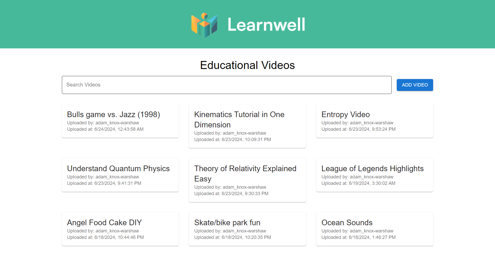
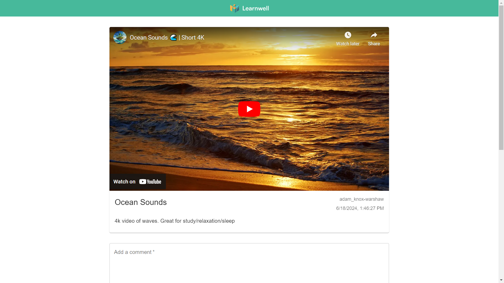
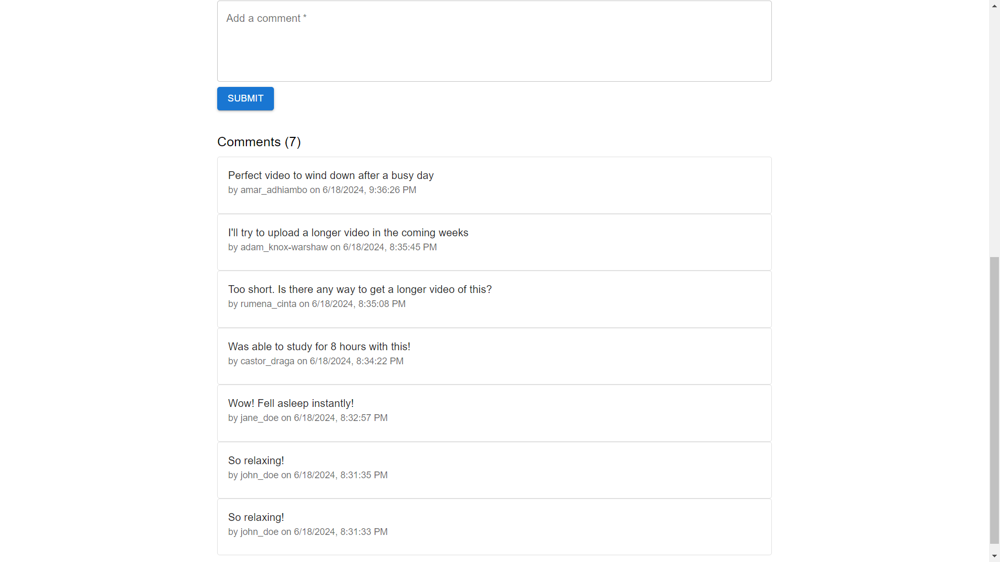

# EdTech Video Application

## Overview
This is a simple web application that allows users to create, comment on, and watch educational videos. The application is built using React and interacts with a provided backend API. As of now, the only type of videos that are supported are from Youtube and Vimeo.

There are two pages to this application, a home page and a video page. The home page has a list of videos and at the top there is a search functionality where you can search for the videos by title. This page is also where a user can upload a new video. On the video page, you will see a video player where you can watch the video, comment on the video, as well as see other users' comments. 

## Features
- Create a new video with title, description, and URL.
- Search for videos by title
- Watch videos in full screen with playback controls.
- Comment on videos and view comments from other users.

## Setup Instructions
1. Clone the repository:
    ```bash
    git clone https://github.com/adamkw66/edtech-video-app.git
    cd edtech-video-app
    ```

2. Install dependencies:
    ```bash
    npm install
    ```

3. Start the development server:
    ```bash
    npm start
    ```

4. Create a `.env.local` file and add the variable `REACT_APP_USER_ID=adam_knox-warshaw`

5. Open `http://localhost:3000` in your browser to view the app.

## Screenshots




## API Integration
The app integrates with a provided backend API for creating videos, fetching videos, and managing comments. The documentation can be found [here](https://take-home-assessment-423502.uc.r.appspot.com/docs)

## Author
Adam Knox-Warshaw
